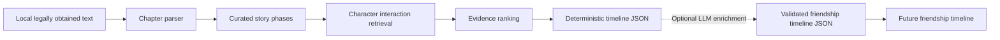

# The Making of a Trio

Phase 1 of a friendship timeline exploring how Harry, Ron, and Hermione's
relationships develop through the first book. This repository implements the
offline analysis pipeline only; it deliberately contains no visualization,
service, database, or API.

## What is implemented

- Local text discovery and proportional chapter parsing
- Five explicitly curated story phases
- Explainable paragraph and compact-window evidence retrieval
- Conservative aliases for Harry, Ron, and Hermione
- Schema-complete deterministic JSON output for a later frontend
- Optional, evidence-only enrichment with local Ollama
- Focused tests using entirely invented text



## Setup and commands

Python 3.10 or newer is recommended.

```bash
python -m venv .venv
source .venv/bin/activate
python -m pip install -r requirements.txt
```

Place one legally obtained `.txt` copy of the first book in `data/input/`.
The first file in case-insensitive filename order is selected.

```bash
python -m scripts.analyze
pytest
```

Use `python -m scripts.analyze --no-llm` to run the complete deterministic
pipeline without Ollama. It always writes a validated
`friendship_timeline.json`. By default, the command also attempts optional
enrichment with local Ollama model `llama3.1:8b`; select another installed
model with `--model`.

The command prints the selected filename, chapter count, total words, and first
and last detected headings. Deterministic candidates are saved to
`data/output/candidates.json` as an intermediate debugging artifact. The final
product output is atomically written to
`data/output/friendship_timeline.json`, the stable contract between the
preprocessing pipeline and future visualization. If optional enrichment fails,
an existing timeline is preserved; on a first run, the deterministic timeline
is written instead.

## How the analysis works

Retrieval finds explicit conservative character aliases, adds a compact
neighboring context window, identifies pair and trio candidates, and ranks them
with explainable signals: number of characters, dialogue markers, simple
action/cooperation/conflict terms, and manageable passage length. Heavily
overlapping passages are removed and only a small ranked set is retained per
phase.

That deterministic evidence populates the complete frontend schema. Explicit
pair co-mentions can establish the conservative `Interacting` level; fields
that require interpretation remain empty and carry a limitation note. The
optional LLM receives only the retained evidence and may enrich the same
schema with summaries, actions, cooperation, conflict, and relationship
reasoning. It cannot change the output contract.

The optional LLM interpretation stage was intentionally not part of the
completed path during the timed 90-minute assessment. The delivered pipeline
therefore runs completely without an LLM via `--no-llm`; model enrichment can
be performed later.

Full pronoun and coreference resolution is outside this phase, so interactions
without an explicit nearby name can be missed. The ranking vocabulary is
intentionally small, and local-model output quality may vary.

## Curated product framing

The phase boundaries are product framing, not automatically detected story
events. They live in one editable configuration in `src/analysis.py`:

- Before Hogwarts: chapters 1–5
- New Classmates: chapters 6–8
- Early Tension: chapter 9
- The Troll: chapter 10
- Working as a Team: chapters 11–17

If a supplied edition parses differently, update that configuration explicitly
rather than relying on inferred events.

Each character pair receives an ordinal visual stage: 0 No relationship, 1
Aware of one another, 2 Interacting, 3 Developing trust, 4 Established
friendship, or 5 Strong team. These are interpreted display stages, not
scientific measurements; tension or weak evidence can produce a plateau.

## Copyright and limitations

Do not search for or download unauthorized source text. The local source and
generated outputs are Git-ignored, and evidence excerpts are capped at 70
words. No book text is included in tests or source control.

The next phase is an interactive friendship timeline that reads the cached
`friendship_timeline.json` without invoking an LLM.
