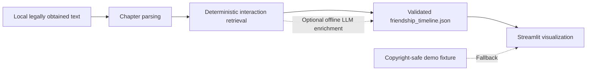

# The Making of a Trio

An interactive timeline showing how Harry, Ron, and Hermione become friends
during the first novel. The timed assessment produced the core local analysis
pipeline: chapter parsing, explainable interaction retrieval, a stable JSON
contract, and focused tests. A lightweight Streamlit visualization and
copyright-safe demo fixture were added afterward to complete the product
experience.

The central tradeoff is deliberate: deterministic output is conservative and
auditable, while richer interpretation is an optional offline step. The
frontend always works from cached JSON and never calls an LLM at runtime.

## Video demo

[Watch the product demo](artifacts/demo.mov)

The demo walks through the five story phases, relationship changes, and supporting evidence.

## Quick start

Python 3.10 or newer is recommended.

```bash
python -m venv .venv
source .venv/bin/activate
python -m pip install -r requirements.txt
streamlit run app.py
```

The app launches with committed demo data, so no book text or model is needed.
Open `http://localhost:8501` if Streamlit does not open it automatically.

To generate a real local timeline, place one legally obtained `.txt` copy of
the first book in `data/input/`, then run:

```bash
python -m scripts.analyze --no-llm
streamlit run app.py
```

Run the tests with:

```bash
pytest
```

## Assessment scope

**Completed during the timed assessment**

- Local text discovery, proportional chapter parsing, and validation
- Five curated story phases with editable chapter boundaries
- Conservative character aliases and deterministic pair/trio retrieval
- Explainable ranking and overlap deduplication
- Validated `friendship_timeline.json` contract with atomic writes
- Copyright-safe input/output handling and focused invented-fixture tests

**Optional or completed afterward**

- Optional local Ollama enrichment using only retrieved evidence
- Schema-complete deterministic fallback for every no-LLM run
- Streamlit visualization and committed demo fixture
- Submission documentation and browser verification

**Known limitations**

- Deterministic co-mentions establish interaction, not trust or intent.
- Full pronoun and coreference resolution is outside scope.
- Ranking uses a small hand-built vocabulary rather than semantic retrieval.
- Local-model quality and latency vary; model enrichment was not required for
  the submitted artifact.

## Architecture



The pipeline locates the first `.txt` file in `data/input/`, parses a credible
consecutive chapter sequence, and assigns chapters to five explicitly curated
phases. Retrieval finds conservative aliases in compact paragraph windows,
identifies pair and trio candidates, and ranks them with explainable signals:
character count, dialogue markers, action/cooperation/conflict terms, and
manageable passage length. Heavily overlapping passages are removed.

Deterministic evidence populates the complete frontend schema. An explicit
pair co-mention can conservatively establish `Interacting`; fields requiring
interpretation remain empty and include a limitation note. Optional Ollama
enrichment receives only retained passages and must return the same validated
schema. It is offline, separate from the UI, and never required to launch the
product.

`data/output/candidates.json` is an intermediate debugging artifact.
`data/output/friendship_timeline.json` is the stable product contract. Both
remain Git-ignored because they may contain source-derived excerpts. The app
prefers the real local timeline and otherwise loads
`data/demo/friendship_timeline.demo.json`, clearly displaying a **Demo data**
notice.

## Product framing

The phases are curated narrative framing, not automatically detected events:

- Before Hogwarts: chapters 1–5
- New Classmates: chapters 6–8
- Early Tension: chapter 9
- The Troll: chapter 10
- Working as a Team: chapters 11–17

Each pair uses a broad ordinal display stage: 0 No relationship, 1 Aware of one
another, 2 Interacting, 3 Developing trust, 4 Established friendship, and 5
Strong team. These are visual interpretations, not scientific scores. The UI
communicates them with line weight, line style, and plain-language labels.

In deterministic mode, stages are based only on explicit nearby character
mentions in retained evidence. A pair interaction can establish `Interacting`,
but higher stages—`Developing trust`, `Established friendship`, and `Strong
team`—require contextual interpretation and are reserved for optional LLM
enrichment. Later deterministic phases may therefore remain at `Interacting`.
This conservative progression avoids overstating the evidence; it is an
intentional accuracy tradeoff, not a visualization bug.

## Copyright handling

The project does not search for or download book text. Local source files,
generated candidates, and real timeline output are Git-ignored. Evidence
excerpts are capped at 70 words, and no source-derived excerpt is committed.
Tests use invented text; the public demo uses clearly invented or paraphrased
placeholder evidence.

## Interview questions

**Why are the phases curated?**

They are product framing, not a classification problem. Explicit boundaries
are faster to review, easy to edit, and avoid pretending the model discovered
the narrative structure.

**Why is retrieval deterministic?**

It makes the evidence path reproducible, testable, and explainable before any
interpretation occurs. It also keeps the pipeline useful without an LLM.

**Why is the LLM offline and optional?**

Analysis generation should not affect UI reliability, latency, or cost. The
app consumes validated cached JSON, while a local model may enrich that
artifact separately.

**Why Streamlit?**

It provides a readable interactive MVP in a small Python codebase, reuses the
assessment stack, and avoids adding a frontend build system or backend.

**How are relationship stages derived?**

Without an LLM, explicit retained co-mentions conservatively reach
`Interacting`; higher stages are left for grounded interpretation. Demo values
illustrate the intended richer progression and are clearly labeled as demo
data.

**How is copyright handled?**

The user supplies a legal local copy. Source text and derived output are
ignored, excerpts are short, and the committed demo and tests contain no
copied passages.

**What would improve with more time?**

Add evaluated coreference resolution, expand and calibrate the retrieval
vocabulary, compare model outputs against a small human-reviewed set, and add
accessibility and responsive-browser regression checks.
